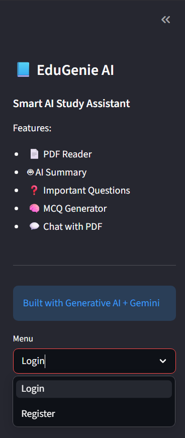
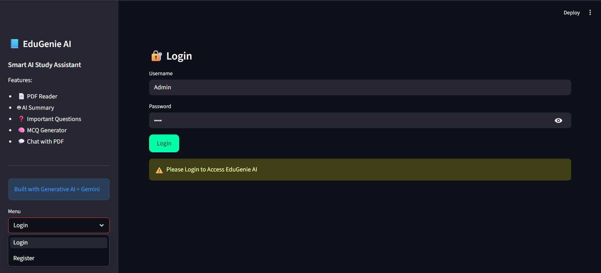
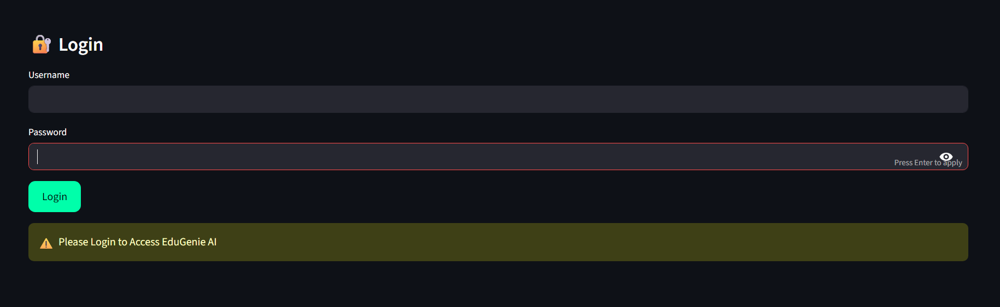
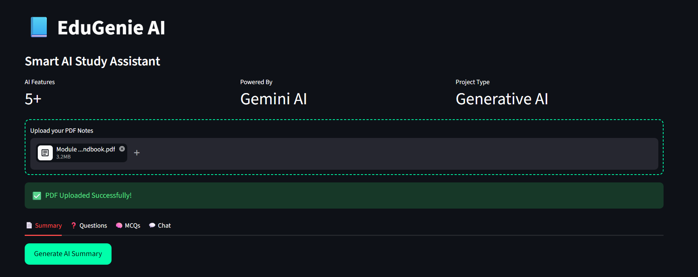
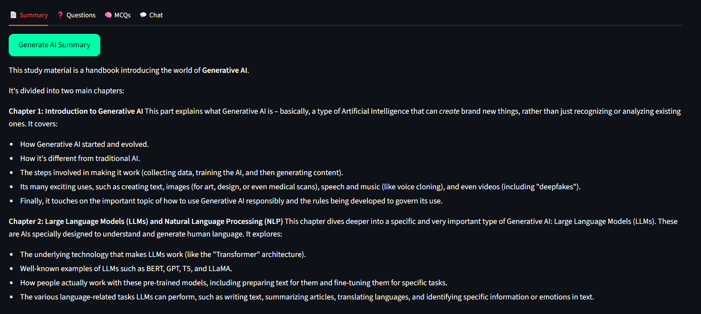
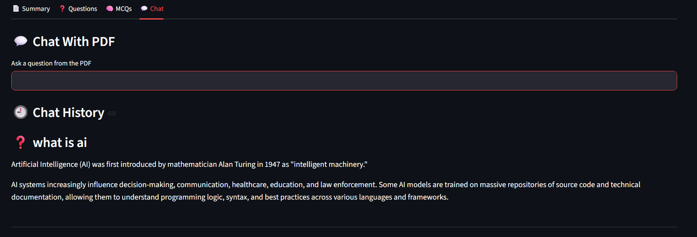

# 📘 EduGenie AI

## 🤖 Smart AI Study Assistant

EduGenie AI is a Generative AI-powered study assistant designed to help students learn smarter using Artificial Intelligence.

The application allows users to upload PDF notes and interact with them using AI-powered features such as summaries, important question generation, MCQ creation, and chatbot interaction.

---

## 🚀 Features

* 📄 PDF Upload & Text Extraction
* 🤖 AI Summary Generator
* ❓ Important Question Generator
* 🧠 AI MCQ Generator
* 💬 Chat With PDF
* 🔐 User Login & Registration
* 🗄 SQLite Database Integration
* 🎨 Professional Dark UI
* ⚡ Streamlit Web Application

---

## 🛠 Technologies Used

* Python
* Streamlit
* Google Gemini AI
* SQLite
* PyPDF2
* LangChain
* FAISS
* Sentence Transformers
* Python-dotenv

---

## 📂 Project Structure

```bash
EduGenie-AI/
│
├── assets/
│   └── style.css
│
├── screenshots/
│   ├── sidebar.png
│   ├── dark-ui.png
│   ├── login-page.png
│   ├── dashboard.png
│   ├── summary.png
│   ├── mcq.png
│   └── chatbot.png
│
├── utils/
│   ├── ai_helper.py
│   └── pdf_reader.py
│
├── .env
├── app.py
├── database.py
├── edugenie.db
├── requirements.txt
├── README.md
└── .gitignore
```

---

## ⚙️ Installation Guide

### 1️⃣ Clone Repository

```bash
git clone https://github.com/SommayDewat/EduGenie-AI.git
```

---

### 2️⃣ Navigate to Project Folder

```bash
cd EduGenie-AI
```

---

### 3️⃣ Create Virtual Environment

```bash
python -m venv .venv
```

---

### 4️⃣ Activate Virtual Environment

#### Windows

```bash
.\.venv\Scripts\activate
```

#### macOS/Linux

```bash
source .venv/bin/activate
```

---

### 5️⃣ Install Dependencies

```bash
pip install -r requirements.txt
```

---

### 6️⃣ Add Gemini API Key

Create a `.env` file in the root directory and add:

```env
GOOGLE_API_KEY=your_api_key_here
```

---

### 7️⃣ Run the Application

```bash
python -m streamlit run app.py
```

---

## 📸 Screenshots

### Sidebar



### Dark UI



### Login Page



### Dashboard



### AI Summary



### MCQ Generator


### Chat With PDF



---

## 🔐 Demo Login Credentials

```bash
Username: Admin
Password: 1234
```

---

## 🎯 Future Improvements

* 🔊 Voice Assistant
* 🧠 AI Flashcards
* ☁️ Cloud Deployment
* 🔐 Password Encryption
* 📊 Analytics Dashboard
* 📱 Mobile Responsive Design

---

## 👨‍💻 Developer

**Sommay Dewat**
Aspiring AI/ML Engineer | Python Developer

---

## ⭐ Support

If you like this project, give it a ⭐ on GitHub and support the project.
